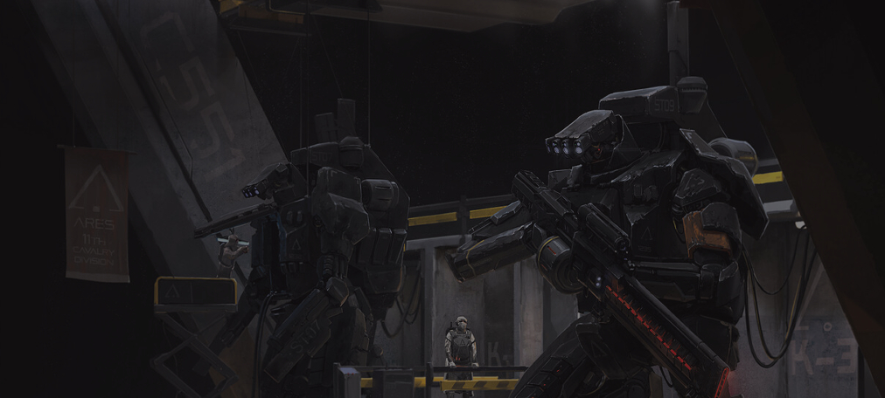
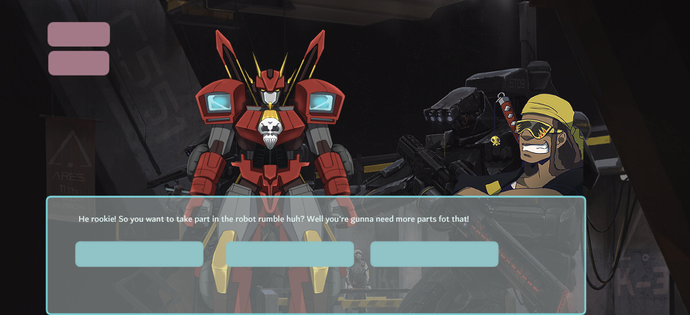

# Build fighter robot

----------
My intentions was to make a story choice game where the user has to haggle items for parts to their robot. In recording the users choices at the end with a final score between 1-100 it'll determine if you got enough parts strong enough to beat the random output opponet. I followed Web Dev simplified to get the skeletal references on how to set up the story mode.

----------

## Getting started / Prerequistes
----------

1.Need simply  Visual Studio code with terminal node. HTML CSS JAVASCRIPT

2.chrome

3.Text Adventure refence:    https://www.youtube.com/watch?v=R1S_NhKkvGA

4.Background image: 

5.Character Speaking: 

----------

## Installing / Attempts / bugs
------
### HTML
-Boiler plate (Html 5)

-Have CSS(style.css) and JAVASCRIPT(game.js) up and link in head of boiler

-body has 1 main div that holds the text and buttons

-Images/ exterior buttons were added in the body on the outside.

### CSS

-many isues insued where I tried to make flex, grid both and neither in css along with the set concept of the text container itself. I did so much reserch on how to overlap everything to get this output:

Reference videos and websites: 

- (Overlapping CSS grid)  https://www.youtube.com/watch?v=HFG3BKOqOlE
- (Guide to grid) https://css-tricks.com/snippets/css/complete-guide-grid/
- (Guide to flexbox) https://css-tricks.com/snippets/css/a-guide-to-flexbox/
- (How to overlap divs) https://css-tricks.com/how-to-stack-elements-in-css/

I tried multiple things to simply get them to sit on top of eachother

### JavaScript

Sadly I never even got the text to translate to the html even though it's linked properly. Somehow lines 1, 19, 20 and 55 refeuse to communicate. textNodes hold arrays of objects where if acted upon the foreach should react to each option. But I've been stuck with even showing

---------
## Goals
---------
I will make a function storing the selections that hold value. For example: if user makes the right choice you gain a part and get 10 more robot strength. Otherwise it would show you loose 10 robot strength from either a bad trade or loss. I hope to display inventory as well as the percentage. Hopefully if I get all of this to work items may go missing from a character who steals them. Then at the end you chose to fight with whatever percentage strength you robot is. For now im not including firepower and assuming both is at an equal fire power. ( may use space battle for help.)
